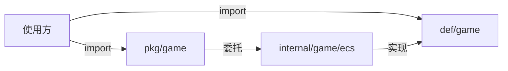

# gbox 框架三层架构说明

> 适用范围：`src/` 下的源码目录。文档约定：代码文档一律以 Markdown 写入 `doc/`。

## 1. 总体结构

```
gbox/
├── src/                  # 代码目录
│   ├── go.mod            # module gbox
│   ├── def/              # 抽象层：接口、枚举、公共类（对外可见）
│   ├── pkg/              # API 层：对外工厂、流程类（对外可见）
│   ├── internal/         # 实现层：默认实现（不对外）
│   └── demo/             # 使用示例（模拟外部使用者）
└── doc/                  # 说明文档（Markdown）
```

三层是**单向依赖**关系，不允许反向或环：

```
def  ←──  pkg  ←──  internal
```

即：

- `def` 不依赖任何包（自包含，纯定义）。
- `pkg` 依赖 `def`（类型/接口）与 `internal`（默认实现）。
- `internal` 只依赖 `def`。
- `pkg` 与 `internal` 之间**禁止互相依赖**（否则成环）。

## 2. 各层职责

### 2.1 `def` —— 抽象定义层

**定位**：定义框架的**基本逻辑和规范**。对外可见，使用方按这里的接口编程。

存放内容：

| 类别 | 说明 | 示例（game 域） |
|:---:|:---|:---|
| 接口 | 抽象行为契约 | `World`、`System`、`Query`、`StateNode` |
| 枚举 | 常量与 ID 类型 | `ComponentID`、`ComponentMask`、`EntityID`、`StateID` |
| 公共类 | 可复用的基础结构/基类 | `State`、`StateContext`、`TransitionRule`、`StateMachine` |
| 工具函数 | 针对本层类型的纯函数 | `Mask(...)`、`NewStateMachine()` |

**规范**：

- 允许出现少量**基础逻辑**（如 `StateMachine` 的节点注册/规则解析），但不得包含具体存储、IO、第三方库实现。
- 不得引用 `pkg` / `internal`。

### 2.2 `pkg` —— 对外 API 层

**定位**：对外暴露的**工厂与流程**实现。入参出参以 `def` 的类型为主，内部提供 `internal` 的默认实现。

存放内容：

- 工厂函数：`NewWorld()`、`NewWorldFrom()`、`NewSystemGroup()`、`NewStateMachineSystem()` 等。
- 组件/系统组：`ComponentMapper`（静态注册/ID 生成）、`SystemGroup`（按优先级调度一组系统）、`BaseSystem`（系统基类）。
- 泛型便捷函数：`RegisterComponent[T]()`、`Add[T]()` 等。
- 流程类：主循环 `GameLoop`、`GameStart(ctx)` 等。

**规范**：

- 返回类型尽量是 `def` 的**接口**（如 `def.World`），不让调用方看到 `internal` 具体类型。
- 业务逻辑薄封装：只做“创建默认实现并返回接口”，复杂实现在 `internal`。

### 2.3 `internal` —— 默认实现层

**定位**：框架的**默认实现**，**不对外**。

> Go 的 `internal` 规则：`gbox/internal/...` 只能被 `gbox/` 根下的包导入。
> 因此**框架的外部使用方永远无法 import `internal`**——这正是把它设为“不对外”的机制保证。

存放内容（game 域）：

- `world`（实现 `def.World`）、`Archetype`、`Column`、组件解析契约 `componentResolver`（由 `pkg/game.ComponentMapper` 实现，静态注册/ID 生成在 pkg 层）。
- `Query`（实现 `def.Query` 的迭代器）。
- `StateMachineSystem`（实现 `def.System`，驱动 `def.StateMachine`，自带优先级/软开关）。

**规范**：

- 只实现 `def` 定义的接口/类，不得反过来定义 `def` 该有的抽象。
- 反射、第三方库等“重量级实现细节”尽量收在 `internal`。

## 3. 为什么这样分

1. **接口稳定**：`def` 一旦定稿，实现随便换（换存储、换调度策略）都不影响使用方。
2. **对外 API 稳定**：`pkg` 只暴露工厂与流程，使用方不接触内部类型。
3. **实现可替换**：`internal` 可整体替换，只要满足 `def` 契约即可。
4. **防止越权使用**：`internal` 的 Go 机制天然挡住外部越权调用。

## 4. 使用方（demo）如何调用

以 ECS/FSM 为例，外部使用者只 import 两个包：

```go
import (
    def  "gbox/def/game"   // 类型 / 接口
    game "gbox/pkg/game"   // 工厂 / 流程
)
```

调用链：



具体 API 见 [game/ecs.md](./game/ecs.md)。

## 5. 游戏域（game）分层清单

| 层 | 包路径 | 内容 |
|:---:|:---|:---|
| def | `gbox/def/game` | `ecs.go`：`ComponentID/ComponentMask/EntityID/Mask`、`World/System/Query`；`fsm.go`：`StateID/State/StateContext/StateNode/TransitionRule/StateMachine` |
| pkg | `gbox/pkg/game` | `ecs.go`：`ComponentMapper/NewComponentMapper/DefaultComponentMapper/GetComponentMapper/NewWorld/NewWorldFrom/NewStateMachineSystem/RegisterComponent/Add/GameLoop/GameStart`；`system.go`：`BaseSystem/SystemGroup/NewSystemGroup/DefaultSystemGroup/GetSystemGroup` |
| internal | `gbox/internal/game/ecs` | `world.go`（world）、`archetype.go`（Archetype/Column/解析契约）、`query.go`（Query）、`fsm.go`（StateMachineSystem）、`component.go`（泛型帮助默认实现） |

> 约定：外部使用方**只 import `def/game` + `pkg/game`**，禁止 import `internal/game/ecs`。
> demo 目录即按此规则编写，可作为“如何正确使用框架”的参考。

## 6. 后续扩展时注意事项

- 新增抽象 → 放 `def`；新增对外工厂/流程 → 放 `pkg`；新增具体实现 → 放 `internal`。
- 任何新增内容先确认依赖方向，禁止 `internal` import `pkg`、`def` import 其他包。
- 若某个“公共类”同时被 `internal` 的默认实现和外部使用方需要（如 `BaseSystem`、`StateMachine`），它应当放在 `def`，否则会因依赖方向产生环。
